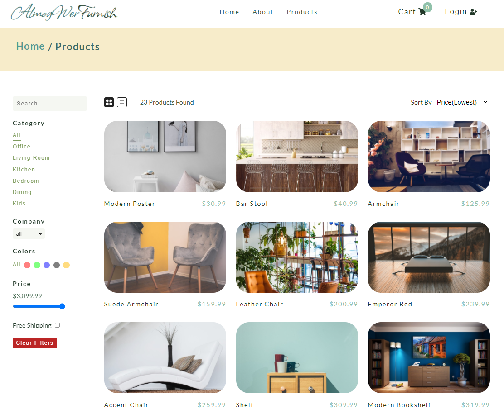
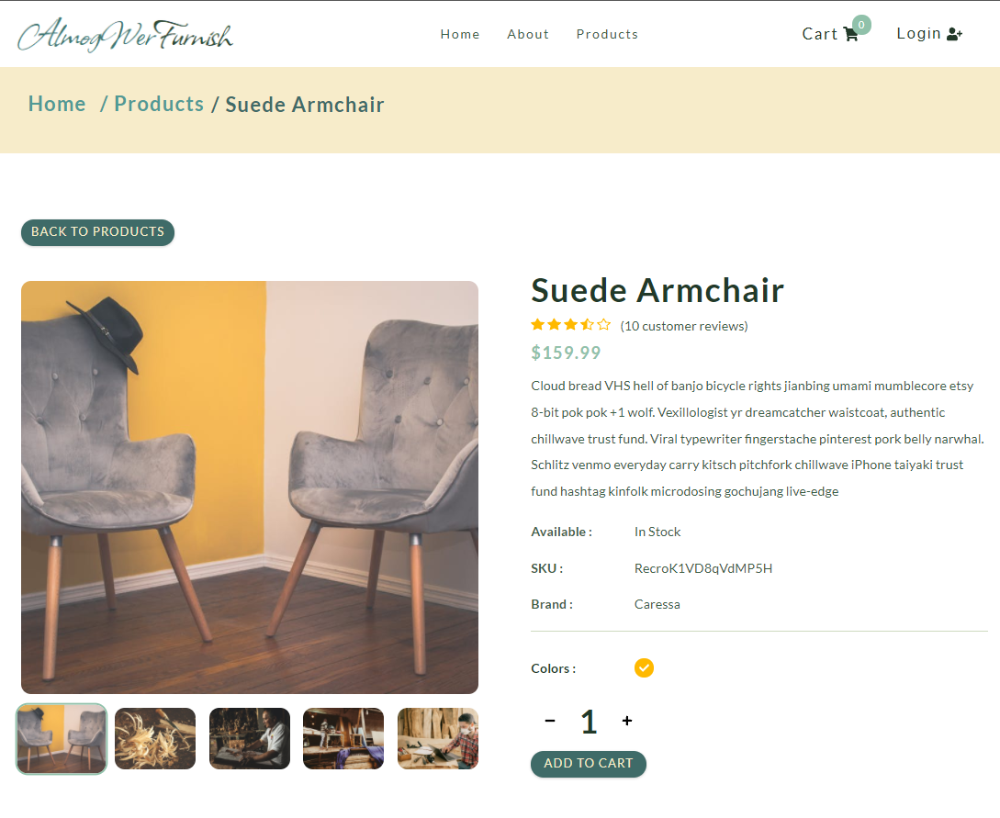

<h1 align="center">Furniture E-Commerce</h1>

## Project Description

React front-end full operating dynamic and responsive E-Commerce shop including payment connection (stripe)

## Built with

- HTML
- CSS
- React

# npm-start

[npm start](https://docs.npmjs.com/cli/v7/commands/npm-start)

```
npm install
```

```
npm-start -g

```

## Links

- [Repo](https://github.com/AlmogWer/furniture-e-commerce "Furniture E-commerce Repo")
- [Live](https://almogwer-furniture-ecommerce.netlify.app/ "Live View")

## Dummy user

```
dummy@user.com
Aadummyuser!
```

## Screenshots & Animation





## Author

- [Almogwer](https://github.com/almogwer)
- [Mail](mailto:Almogish@gmail.com?Subject=Hi% "Hi!")
- [Linkedin](https://www.linkedin.com/in/almogwertzberger/)

## Styled Components

[Styled-Components - Main Docs](https://styled-components.com/)

```jsx
import styled from "styled-components";

const ReactComponent = () => {
 return <Wrapper>
 {some content}
 </Wrapper>
}


const Wrapper = styled.htmlElement`
write your styles here
`
export default ReactComponent
```

## React Icons

[React Icons - Main Docs](https://react-icons.github.io/react-icons/)

## React Version

```
"react": "^17.0.1",
"react-dom": "^17.0.1",
"react-scripts": "4.0.0",
```

- [react-router-dom - Main Docs](https://reactrouter.com/web/guides/quick-start)

- <Switch> renders the first child <Route> that matches
- A <Route path="*"> always matches

## Furniture API

- [Get Single Product](https://course-api.com/react-store-single-product?id=)
- [Get Products](https://course-api.com/react-store-products)

## Stripe

- [Stripe - Main Docs](https://stripe.com/docs/payments?payments=popular)
- [Stripe - React ](https://stripe.com/docs/stripe-js/react)

## Auth0

- [Auth0 - Main Docs](https://auth0.com/)
- [React SDK Docs](https://auth0.com/docs/libraries/auth0-react)
- [REACT SDK API Docs](https://auth0.github.io/auth0-react/)

## Env vars

- [dotenv - Main Docs](https://www.npmjs.com/package/dotenv)

- REACT_APP_AUTH_DOMAIN=
- REACT_APP_CLIENT_ID=
- REACT_APP_STRIPE_PUBLIC_KEY=
- REACT_APP_STRIPE_SECRET_KEY=

```

npm install dotenv@8.2.0

```

## Deployment

[Netlify](https://www.netlify.com/)

```

npm install netlify-cli -D

```

